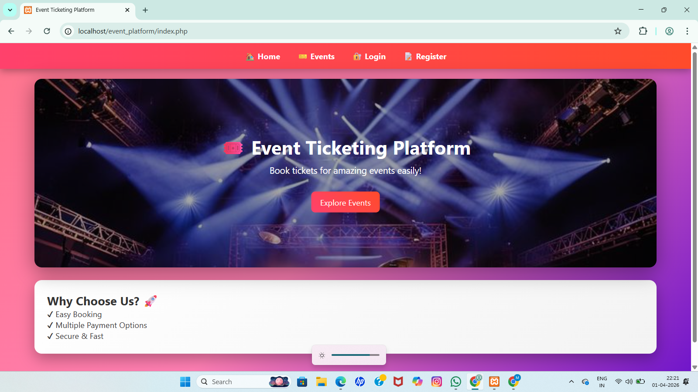
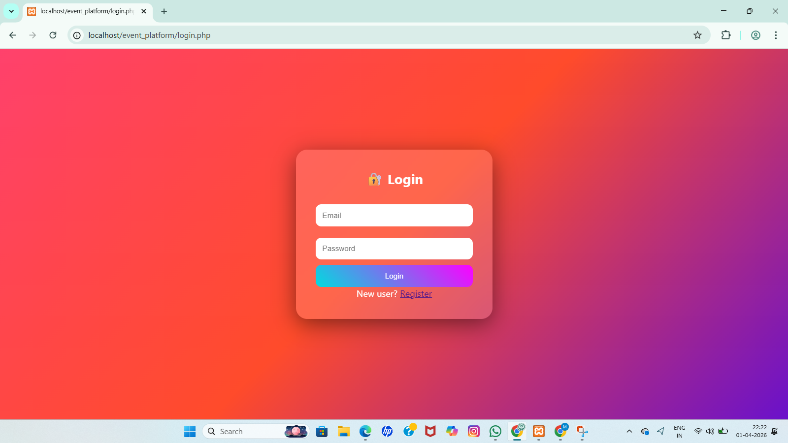
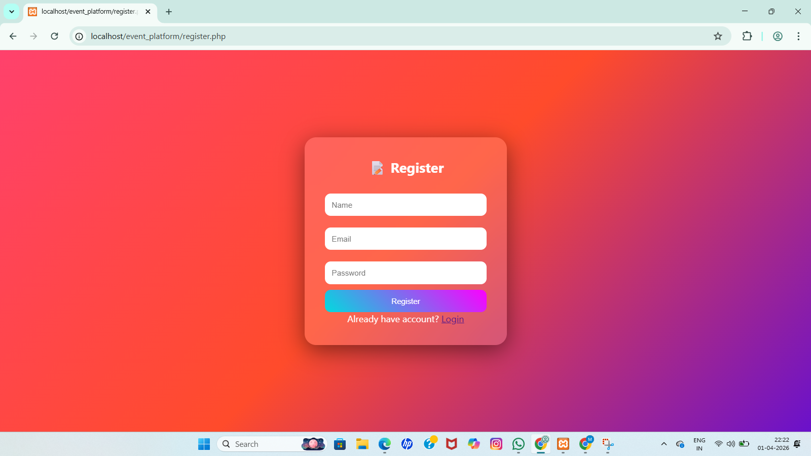
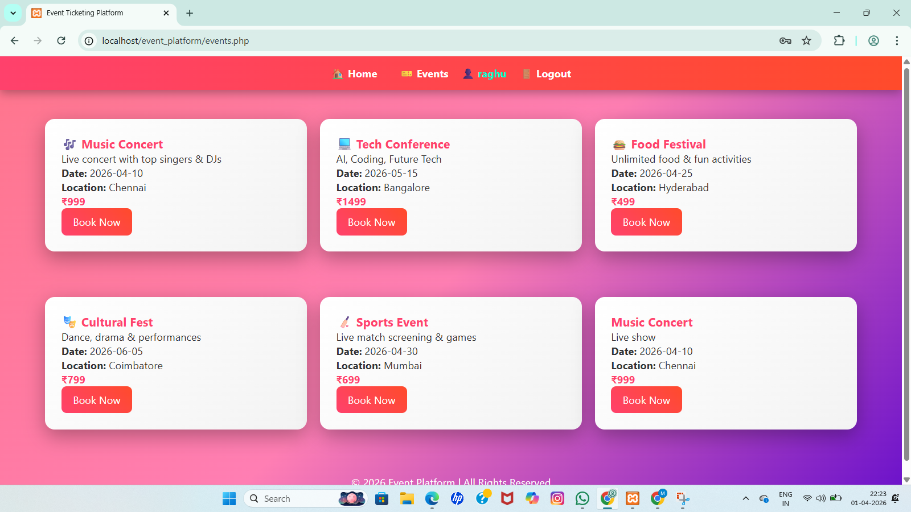
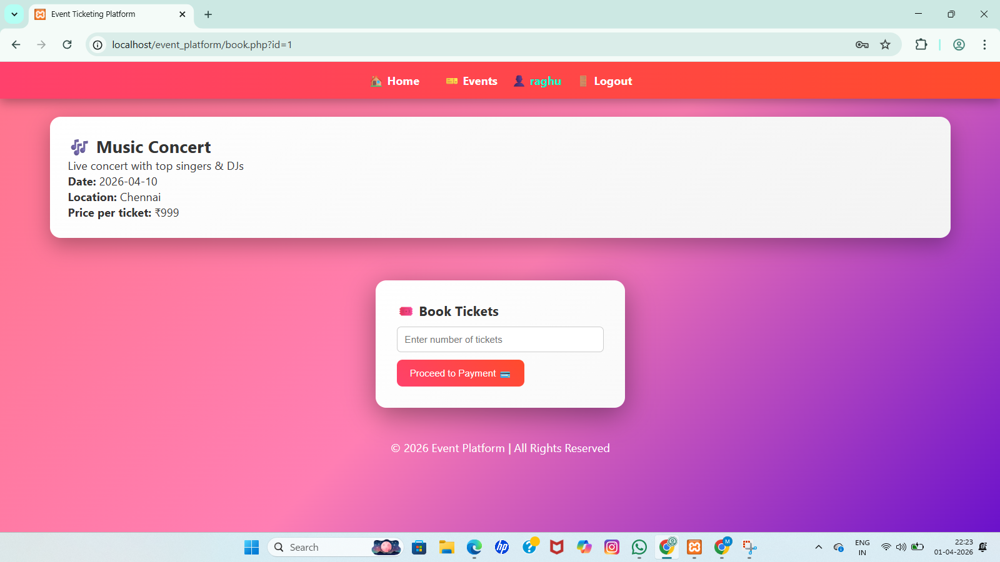
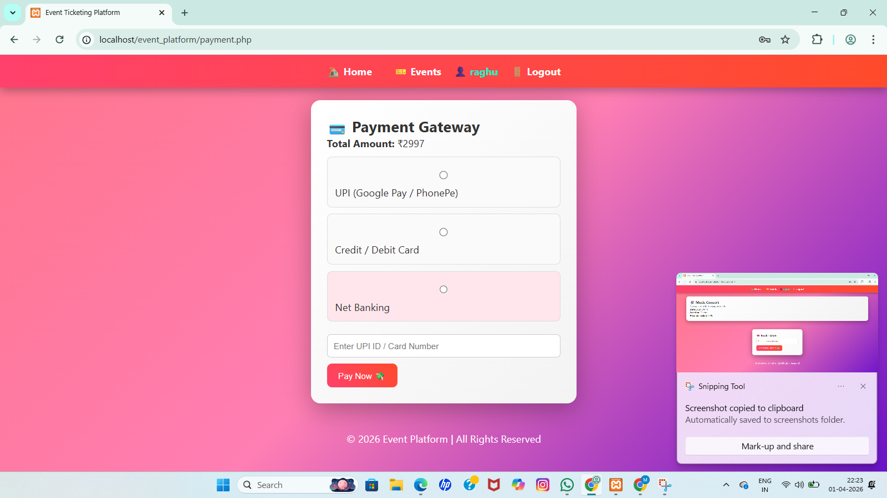

# End-to-End-Event-Lifecycle-And-Ticketing-Platform
1. ## 📌 Project Description

The End-to-End Event Lifecycle & Ticketing Platform is a web-based application designed to manage the complete process of event handling, from event listing to ticket booking and payment. 

This system allows users to browse available events, register/login securely, book tickets by selecting the number of attendees, and complete payments through an interactive interface. After successful booking, users can download a professionally designed PDF ticket with all event details.

The platform improves efficiency by automating the entire ticketing process, reducing manual effort, and ensuring better user experience with a visually attractive and responsive interface.

It is developed using PHP for backend processing, MySQL for database management, and HTML/CSS for frontend design, implemented using the XAMPP environment.

2.## 🎯 Key Features

- User Registration & Login System
- Event Listing and Browsing
- Ticket Booking with Multiple Persons
- Payment Interface (UI-based)
- Downloadable PDF Ticket
- Premium Ticket Design (Gradient, Border, Ticket ID)
- Session Management for User Tracking
- 
3. ## 📂 System Structure``

event_platform/
│
├── css/              # Stylesheets for UI design
├── images/           # Images used in website
├── includes/         # Header, footer, database connection
├── fpdf/             # PDF generation library
│
├── index.php         # Home page
├── events.php        # Displays all events
├── book.php          # Ticket booking page
├── payment.php       # Payment interface
├── success.php       # Booking success page
├── ticket.php        # PDF ticket generation
├── login.php         # User login
├── register.php      # User registration
├── logout.php        # Logout functionality

4. ## ⚙️ Working Flow

1. User registers or logs into the system
2. User browses available events
3. User selects an event and enters number of persons
4. User proceeds to payment page
5. Payment is processed (simulated)
6. Booking is confirmed
7. User downloads a professional PDF ticket

8. 5. ## 🧩 Modules

### Module 1: User Management
Handles user registration, login, and session management.

### Module 2: Event Management
Displays event details including date, location, and price.

### Module 3: Booking & Payment
Allows users to book tickets and complete payment.

### Module 4: Ticket Generation
Generates a downloadable PDF ticket with professional design. 

6.## ✅ Advantages

- Reduces manual work in ticket booking
- Provides fast and easy access to events
- User-friendly and attractive interface
- Generates professional downloadable tickets
- Supports multiple users and bookings
- Improves accuracy and efficiency

7. ## 🚀 Future Enhancements

- Integration of real payment gateway (Razorpay/Stripe)
- Admin panel for event management
- Email/SMS ticket confirmation
- QR code-based ticket verification
- Mobile responsive improvements
- Advanced security features

8. ## 🛠️ Tools Used

- XAMPP – Local server environment (Apache & MySQL)
- phpMyAdmin – Database management
- Visual Studio Code – Code editor
- Web Browser (Chrome/Edge) – Testing the application

9. ## 💻 Technologies Used

- Frontend: HTML, CSS
- Backend: PHP (Core PHP)
- Database: MySQL

10. ## ⚙️ Development Environment

- Operating System: Windows
- Server: Apache (via XAMPP)
- Database Server: MySQL
- Runtime Environment: PHP

11. ## 🌐 Project Domain

The project is hosted on a local server using XAMPP.

Access URL: http://localhost/event_platform 

12. ## 📸 Screenshots

### 🏠 Home Page

### 🎉 Events Page

### 📝 Booking Page

### 💳 Payment Page

### ✅ Success Page

### 🎫 Ticket PDF

